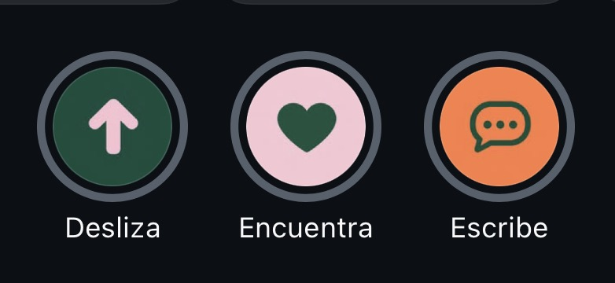

# Marca, ilustración y fondos

Cómo se ve Deslizapp fuera de los controles: la idea que la resume, el logo según a quién le habla, los fondos con patrón, las ilustraciones y las fotos. Aplica a redes sociales, catálogo público, pantallas vacías, bienvenida y novedades de la app.

## La idea en tres palabras

Deslizapp se resume en **Desliza, Encuentra, Escribe**: el recorrido del comprador, de ver a pedir.

| Palabra | Símbolo | Color del círculo | Qué representa |
|---|---|---|---|
| **Desliza** | Flecha hacia arriba | Verde Bosque con flecha Rosa | Explorar el catálogo como un feed |
| **Encuentra** | Corazón | Rosa con corazón Verde Bosque | El "aaah": darle "Lo quiero" a lo que gusta |
| **Escribe** (o **Pide**) | Burbuja de chat con tres puntos | Mandarina con burbuja Verde Bosque | Mandar el pedido por WhatsApp |

- Siempre en ese orden, de izquierda a derecha o de arriba abajo, porque cuentan una secuencia.
- Los tres símbolos son la base de la iconografía de la marca: la flecha aparece en el isotipo, el corazón en "Lo quiero" y los "aaahs", y la burbuja en todo lo que lleve a WhatsApp.
- En la app, estos tres iconos se usan siempre para esas tres acciones y para nada más.
- Variante para redes: "Desliza. Dale aaah. Pide."

## El concepto: varias apps en una

Deslizapp mezcla, a nivel de idea, lo mejor de varias apps que la gente ya usa todos los días. Cada una se asocia con un color de la marca, y por eso los colores no son arbitrarios:

| Referencia | Color | Qué aporta a Deslizapp | Dónde se nota |
|---|---|---|---|
| **Instagram** | Rosa | Descubrir: mirar productos como un feed, que gusten y que se quiera | Fondos y piezas para compradores, corazón de "Lo quiero", "aaah" |
| **WhatsApp** | Verde Bosque | Conversar y confiar: el pedido se cierra hablando con la tienda | Color principal y de acción, burbuja de chat, "Escribe/Pide" |
| **Amazon** | Mandarina | Comprar: la acción que cierra la compra, con precio y llamada clara | Botón flotante, contadores de atención, una llamada emocional por pantalla |
| **TikTok** | (el gesto, no un color) | Deslizar: pasar de un producto a otro con el pulgar | La flecha del isotipo y el catálogo en reel |

- Es un **concepto que guía**, no una licencia para copiar: de cada app se toma la sensación (descubrir, conversar, comprar, deslizar), nunca su logo, su tipografía ni su diseño.
- Encaja con el recorrido **Desliza, Encuentra, Escribe**: desliza (TikTok) → encuentra, "aaah" (Instagram, rosa) → escribe y pide (WhatsApp y Amazon, verde y mandarina). Por eso el círculo de "Escribe" es Mandarina con la burbuja en Verde Bosque: comprar (Amazon) conversando (WhatsApp).
- Encaja con las reglas de color de la app: **verde = seguir adelante** (confianza de WhatsApp), **Mandarina = una sola llamada por pantalla** (el botón de comprar de Amazon, no se reparte), **rosa = marca y decoración, no estado** (el ambiente de Instagram).
- Al decidir un color nuevo o una pieza nueva, la pregunta es: ¿esto es descubrir (rosa), conversar (verde) o comprar (mandarina)?

## Logo según el público

El isotipo es una "d" redondeada con una flecha hacia arriba (deslizar), dentro de un cuadrado de esquinas suaves. El logotipo "deslizapp" va en Fredoka, en minúsculas.

| Público | Fondo del isotipo | Isotipo | Dónde |
|---|---|---|---|
| **Compradores** (catálogo público, publicaciones para clientes) | Rosa Suave | Verde Bosque | Catálogos, piezas "Tu pulgar tiene buen gusto", "¿Estoy comprando o haciendo diligencias?" |
| **Vendedores** (la app del panel, publicaciones para tiendas) | Verde pálido (Menta #dcebe2) | Verde Bosque | Icono de la app instalada, cabecera de la app, piezas para tiendas |

- El isotipo siempre es Verde Bosque; lo que cambia según el público es el fondo pálido: rosa para compradores, menta para vendedores.
- El logotipo "deslizapp" va en Verde Bosque sobre fondos claros y en Papel Cálido sobre fondos Verde Bosque.
- Nunca se deforma, se gira ni se le cambia la flecha. Nunca sobre una foto sin un fondo sólido detrás.
- **Icono de la app instalada:** fondo verde pálido (Menta #dcebe2) con el isotipo Verde Bosque y un **borde Menta** alrededor del isotipo (90 de 2048 unidades, unos 8 px en un icono de 180). En claro el borde se confunde con el fondo y no se ve. En modo oscuro, iOS cambia el fondo por negro (las apps web no pueden tener icono oscuro propio) y ese borde dibuja el contorno del isotipo, que sin él desaparece (Verde Bosque sobre negro es 1.7:1).
- **Pendiente detectado:** algunas piezas para vendedores usan el fondo rosa; al aplicar la regla pasan al fondo menta.

## Fondos con patrón

Las piezas de marca usan un fondo plano de un solo color de marca, con uno o dos patrones encima. El fondo dice a quién le habla: **rosa para compradores, Verde Bosque para vendedores**.

Patrones disponibles (máximo dos por pieza):

1. **Iconos regados (el patrón principal):** los tres símbolos de la filosofía, la flecha (Desliza), el corazón (Encuentra) y la burbuja de chat (Escribe), repetidos por toda la pieza en distintos tamaños y ligeramente girados, como un papel tapiz. Van en un tono apenas distinto del fondo: rosa más intenso sobre rosa (#eeb0c5), verde un poco más claro sobre Verde Bosque (#2b6550). Detrás del texto se desvanecen o quedan tan suaves que no bajan el contraste.
2. **Destellos:** tres trazos cortos que salen de un objeto o palabra para darle énfasis (como un "¡pum!"), en Mandarina. Máximo tres grupos por pieza.
3. **Flecha curva gruesa:** en Mandarina, para conectar dos cosas (catálogo → app, "lo quiero" → "pedido recibido"). Una por pieza.

El logo en las piezas es siempre el isotipo real (`public/icons/isotipo.svg`), nunca uno redibujado, sobre su cuadro pálido (rosa para compradores, menta para vendedores) y junto al logotipo "deslizapp" en Fredoka.

**Reglas**

- El patrón siempre queda detrás del contenido y nunca baja el contraste del texto.
- Los objetos flotantes (corazón, bolsa, burbuja) van en tarjetas redondeadas con volumen, como fichas, en Papel, Mandarina o Rosa.
- **En la app** los patrones se usan con moderación: solo en bienvenida, novedades, pantallas vacías, celebraciones y el catálogo público. Nunca detrás de listas, formularios o números.

## Titulares de piezas

- Fredoka extrabold, muy grande, con interlineado apretado.
- Dos colores por titular: la primera parte en Verde Bosque (o Papel sobre verde) y la palabra clave en Mandarina (o Rosa sobre verde): "Mejor, **desliza**.", "Tu tienda merece su **aaah**."
- Debajo, una frase corta en Figtree o Fredoka semibold que explica.
- Arriba a la izquierda el logo; arriba a la derecha la paginación del carrusel ("01 / 10").
- Rótulos sobre teléfonos y llamadas a la acción en píldoras de Papel Cálido con texto en mayúsculas espaciadas ("CATÁLOGO · CLIENTE") o en Verde Bosque con flecha ("Desliza →").

## Ilustraciones

Estilo **3D de plastilina**: volúmenes redondeados, acabado mate y suave, como modelado a mano, con sombras propias y sin contorno.

- **Paleta:** solo colores de la marca (Verde Bosque, Rosa Suave, Menta, Papel Cálido, Mandarina) y un toque dorado o amarillo suave para brillos y herrajes.
- **Fondo transparente**, para que funcionen sobre Papel, Rosa o Verde.
- **Una idea por ilustración**, con 1 a 3 objetos: tarjetas de producto, bolsas, perfumes, tenis, etiquetas de precio, cajas, gráficas, corazones.
- **Personas** como figuras abstractas (una esfera y un medio óvalo), sin cara, en colores de marca. Nunca personajes con rostro.
- **Detalles de vida:** estrellas de cuatro puntas (Mandarina o dorada) con destellos, y trazos curvos en Menta que sugieren movimiento o crecimiento.
- **Dónde van en la app:** estados vacíos, bienvenida, novedades, celebraciones y explicaciones de funciones. Nunca como decoración junto a datos.
- Tamaño en la app: entre 120 y 200 px de ancho, centradas, con el texto debajo.

## Fotografía y personas

- **Personas reales dominicanas y latinas**, de distintos tonos de piel y tipos de pelo, de 20 a 40 años, con ropa casual y colorida.
- **Emoción clara y una por foto:** alegría o sorpresa al encontrar algo (el "aaah"), satisfacción del vendedor al recibir pedidos, y frustración solo para mostrar el "antes" (el chat lleno de "¿Precio?").
- **Producto real y protagonista:** perfumes, bolsos, ropa, tenis, en primer plano y bien iluminados.
- **Teléfonos con la interfaz real** de Deslizapp (catálogo para compradores, panel para vendedores), nunca pantallas inventadas que no existen.
- **Luz cálida y suave**, fondos rosa con flores para compradores, o tienda con plantas y madera para vendedores.
- Las fotos son para redes y el catálogo público. La app del vendedor no usa fotos de personas, solo las fotos de sus productos.

## Ejemplos

Ilustraciones de referencia: ver el grupo **Ilustraciones**. Piezas de redes con fondos, titulares y fotos: ver el grupo **Redes**.
