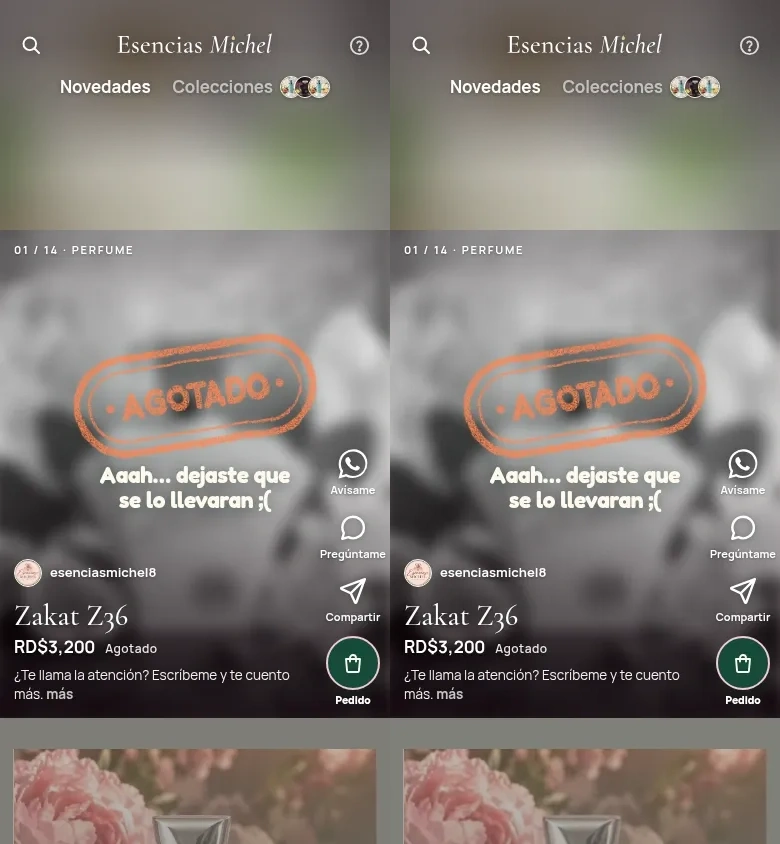

# Catálogo: primera carga y convivencia de sesiones

PR #45 en borrador, dependiente de PR #44; base `feature/catalogo-react`, no `main`. Main revisado: `1d8bf5d081cdcc8fe497deac342cbece37572e7f`; head de PR #44: `a56553756e6c4e5ad2b25a52c2e67962dc73e8f6`, abierto y sin fusionar. Prompt leído desde `docs/pedido-catalogo-panel:docs/prompts/catalogo-rendimiento.md`, sin incorporar esa rama. Este trabajo no implementa pedido-catalogo-panel.

## Diagnóstico comprobado

La traza de la versión anterior muestra dos portadas con prioridad simultánea. Se descargan originales del primer producto (125 KB), Delilah (172 KB) y Yara (220 KB); otro `Image` de extracción de color vuelve a solicitar el original del primero. Miniaturas de colecciones también descargan originales. No basta con sumar esas fotos: compiten con JavaScript y fuentes y retrasan la interacción.

En la primera ventana entran el adaptador completo de Supabase (incluye operaciones del panel), datos demo/seed, recibos y vistas no abiertas. Dos chunks representativos transfieren 77.397 y 72.579 bytes comprimidos. La nueva entrada pública comparte **las mismas cinco operaciones**, sin consultas duplicadas: demo se importa solo en demo, cliente real al solicitar una operación, y servidor usa directamente la inicialización anónima. No modifica el contrato, errores, RLS ni autenticación del panel.

El salto inicial de layout mueve la cabecera/portada tras la hidratación: los defaults CSS no coinciden con el cálculo definitivo de JS. La traza registra CLS 0,848. Los defaults ahora expresan esa geometría inicial, incluidos viewport pequeño y escritorio, sin rediseñar la posición final.

La foto anterior termina alrededor de 5,24 s; el documento de la ejecución representativa responde en 476 ms y termina en 645 ms. Después, documento 452/770 ms, foto 1,33 s e interacción 2,72 s. **No se midió separadamente el tiempo SQL/RPC del servidor**: TTFB incluye servidor y red. No hay evidencia suficiente para atribuir la lentitud a Supabase; no se alteró base, plan ni permisos.

## Cambio conservando la superficie aprobada

- Next Image sirve tamaños/formato adaptados con `srcset`/`sizes` manteniendo ``, CSS, recorte y calidad 85. Solo hosts/rutas públicas permitidas; URLs desconocidas conservan el original. No depende de transformaciones del plan de Supabase. No se recomprimen archivos de producción ni del panel.
- Prioridad alta solo para medio visible; vecinos después de la foto inicial y 500 ms. Video/poster se solicita solo cuando está activo; autoplay permitido, sonido, pausa fuera de vista y movimiento reducido conservados.
- Extracción de borde conserva canvas 24×24, algoritmo/CORS y fallback; fuente de 32 px. Fondo decorativo reutiliza la imagen responsiva de portada. Colecciones/logo usan tamaños pequeños cuando su URL está permitida.
- Coach, historias, planes y recibo PNG/PDF bajo demanda. Las fuentes de la identidad no cambian. Datos públicos frescos del servidor, sin cachear precios/stock para mejorar la cifra.
- `#p/{slug}` selecciona el producto al entrar. El HTML estático y `tiendas.url_catalogo` siguen intactos. No cambia movimiento, hojas o formularios.

## Método y reproducibilidad

Cinco contextos fríos **por versión** en build de producción, Chromium `151.0.7922.173`, 390×844, DPR 1, touch/mobile, CPU 1 (sin ralentización), red CDP 1,6 Mbps/150 ms. No se ejecutaron build/tests durante las cargas finales. Caché de navegador vacía/deshabilitada y SW bloqueado. Además, contexto nuevo con SW normal y segunda navegación en ese contexto. CDN/optimizador del servidor no se purgan: son cachés compartidas del servicio, no una caché caliente del navegador. No equivale a un primer miss global del optimizador.

Tiendas/datos reales de lectura: Esencias Michel, 14 productos, mismo primer producto Zakat Z36 agotado/RD$3.200 y misma foto; no hubo escrituras de esta sesión. La base compartida no se congeló ni se guardó una huella completa del conjunto antes de las dos series. Esa limitación impide certificar que ningún campo ajeno cambió entre series. Los fixtures de regresión son independientes y demo.

Antes: código `a565537`, localhost:3220. Después: código de `d66271b` (mismo árbol que el build local `b18189e`), localhost:3230 en worktree aislado. Solo cambia el puerto de origen, no el perfil. No se toca la carpeta anterior. La traza CDP confirma **gzip** de documento/JS/CSS en ambos builds locales; imágenes/fuentes sin Content-Encoding adicional. Compresión/caché reales de Vercel pendientes.

El script ahora observa desde el inicio de navegación, espera imagen decodificada/visible, nombre, precio y un handler hidratado en «más»; también toca ese control y verifica apertura/cierre. No espera `load` para iniciar el cronómetro. Transferencia hasta utilizable y ventana fija de 12 s se miden por CDP. `decode()` aquí mide la espera restante de esa llamada, no todo el trabajo interno del decodificador. LCP/CLS son observadores de esta sesión de laboratorio, no datos de campo.

El resultado histórico de **7.086 ms / 1.158.100 bytes / 28 solicitudes** sigue en `docs/capturas/catalogo-react/rendimiento.json`. No se compara con los nuevos tiempos: la versión anterior se volvió a medir con el criterio corregido. Resource Timing da ceros para ciertos recursos externos sin TAO: no se interpretan como ahorro. Bytes CDP incluyen tráfico observado, no una contabilidad de facturación.

```bash
# Con cada versión construida y el servidor correspondiente arrancado:
PLAYWRIGHT_MODULE=/ruta/a/playwright URL=http://localhost:3230 \
  SALIDA=/tmp/catalogo-lab ETIQUETA=despues node scripts/medir-catalogo.mjs
# Restaurar solo la versión anterior en OTRO checkout; no cambiar el checkout de otra sesión.
# VECES=5 es el default. AUTH_STATE_FILE acepta cookies autorizadas, sin incluir SSO en el cronómetro.
```

## Cinco cargas frías: mediana [mínimo–máximo]

| Medida | Antes | Después |
|---|---:|---:|
| Foto visible/decodificada | 5.244 ms [5.057–5.362] | 1.328 ms [1.144–1.427] |
| Primer reel utilizable | 5.245 ms [5.057–5.366] | **2.723 ms [2.656–2.800]** |
| LCP | 5.264 ms [5.076–5.400] | **1.504 ms [1.232–2.732]** |
| CLS | 0,848395 [igual] | **0,000053 [igual]** |
| Bytes hasta utilizable | 764.132 [764.124–764.393] | 438.468 [438.468–438.469] |
| Bytes en 12 s | 1.283.971 [1.283.954–1.283.983] | **476.000 [476.000–476.002]** |
| Solicitudes en 12 s | 31 | 31 |
| Siguiente reel ya disponible al deslizar | 11 ms [6–41] | 6 ms [4–27] |
| Primera apertura del carrito vacío | 155 ms [132–233] | 156 ms [129–212] |

Las tres metas de **mediana local** se cumplen (utilizable ≤3 s, LCP ≤2,5 s, CLS ≤0,1). Dos LCP individuales superan 2,5 s: no se garantiza cada carga. Interacción 48 % menor; transferencia a 12 s 63 % menor. Cantidad de solicitudes no disminuye: se cambian tamaño, prioridad y momento. Portada 390 px representativa: 22.331 bytes frente a original ~125 KB. Delilah progresivo 33.807 frente a ~172 KB. No se mide nitidez por número de bytes.

Los tiempos al deslizar miden el vecino que ya pudo precargarse durante la ventana de 12 s; **no prueban un gesto inmediato antes de su descarga**. Primera apertura de carrito vacío sí se cronometra en cada ejecución. Recibos demo sin limitación de red y después del catálogo: primera carga PDF **377 ms**, PNG como primer uso en página nueva **271 ms**, PNG después del PDF **100 ms**. Son tres muestras funcionales, no cinco cargas 4G de cada recibo ni comparación antes/después de recibos; pendiente esa comparación específica.

### SW normal / carga repetida

| Medida | Antes | Después |
|---|---:|---:|
| Utilizable con SW permitido, contexto nuevo | 5.283 ms | 2.436 ms |
| Utilizable repetida | 1.275 ms | 953 ms |
| Foto repetida | 798 ms | 694 ms |
| LCP repetida | 952 ms | 792 ms |
| CLS repetida | 0 | 0 |

Una muestra por caso; no medianas. El CDP del target de página solo registra 347 bytes en repetida; respuestas del SW/caché pueden quedar fuera. **No se afirma ahorro de transferencia a partir de ese dato**; sería necesario instrumentar también el worker.

## Evidencias y regresiones

[Carpeta de evidencias](capturas/catalogo-rendimiento/): resumen JSON, resultados completos comprimidos, trazas Chrome completas representativas (antes fría 2 / después fría 3), capturas reales y resultados de recorridos/DPR. Las otras trazas completas se generaron localmente y pueden reproducirse con el script. Descomprimir `.json.gz` antes de importar la traza en DevTools Performance/Perfetto. No contienen cookies ni enlaces de acceso temporales.



Capturas de enlace directo con DPR 3: [360 px](capturas/catalogo-rendimiento/360-mayar.webp), [390 px](capturas/catalogo-rendimiento/390-mayar.webp), [430 px](capturas/catalogo-rendimiento/430-mayar.webp). Los originales limitan la resolución real: seleccionar un candidato para DPR 3 no inventa detalle ni implica que la fuente tenga ese tamaño.

- TypeScript (`next typegen`, `tsc --noEmit`), lint (0 errores/27 advertencias), **197/197 tests** y build Turbopack: pasaron.
- Catálogo: **9/9 grupos** demo, video/carrusel, sonido/pausa, variantes/precios, agotados, avisos visibles en panel, encargo, solicitud, WhatsApp interceptado sin envío, PNG/PDF, atrás/Escape, foco, movimiento reducido y overflow a 430.
- Errores de catálogo: **2/2**, red interrumpida y límite; todas las escrituras reales interceptadas.
- Lectura pública/DPR 3: **6/6** (inicio y enlace directo a 360/390/430), portada optimizada, color visible, sin video vecino cargado, overflow ni errores de página; cualquier escritura RPC abortada.
- Hojas apiladas/aviso al salir, teclado/foco simulado, inventario demo y producto **42/42**: pasaron. No simulan teclado físico de Safari.
- Comparador contra HTML: **42/42 pares**, 14 estados a 360/390/430; fixture demo, sin escrituras reales. Primer reel: 1,64/1,43/2,15 % de diferencia; perfil conserva la diferencia conocida por la biografía/modelo real (~26–27 %). Imágenes responsivas/calidad 85 añaden variación visual pequeña. La métrica no certifica equivalencia pixel a pixel. Resultados y un par representativo incluidos en las evidencias.

Intentos no aprobados: build con symlink externo rechazado por Turbopack; primeras ejecuciones restringidas fallaron al descargar fuentes/abrir puerto interno. Build limpio autorizado con dependencias copiadas **pasó**. El entorno restringido del runner solo reportaba archivos, no sus casos: el total válido es la repetición de **197 tests**. Primer recorrido falló por puerto 3220 escrito fijo en la aserción; corregido para usar URL y repetido 9/9. Chequeo DPR inicial usaba `naturalWidth` (ajustado por densidad) y navegación solo de fragmento; corregido a ancho solicitado y navegación nueva. No fueron aprobados esos intentos.

## Pendiente y alcance de la entrega

Preview del código `d66271b`: **READY**, https://deslizapp-5hf2pmp1r-onedayone.vercel.app/tienda/esencias-michel. El build de Vercel no demuestra rendimiento interactivo. Preview protegido por SSO: cinco cargas comparables antes/después en Vercel, su compresión y caché siguen **bloqueadas**. La revisión automática rechazó crear un acceso temporal de 23 h por exponer un despliegue protegido; se pidió autorización explícita y no se eludió mediante otra herramienta.

Safari/iPhone físico/WebKit pendientes (el WebKit instalado no inicia en este entorno). Datos móviles reales, gesto rápido antes de precarga, retorno de WhatsApp y compartir archivos nativo necesitan validación de Lewis. No declarar Core Web Vitals aprobado. Se deja el rendimiento del preview pendiente, aunque las metas medianas locales pasen.

**Supabase:** cero migraciones, escrituras o cambios de historia; solicitud `4DCQ2PZ28F` intacta. Pruebas que escriben usan demo con fixtures independientes. No se registra/discarda ninguna solicitud real. PR #45 no fusionado; PR #44 tampoco. Producción conserva su despliegue, HTML y enlace actual.

## Comprobación de Lewis en iPhone

1. Abre el preview con tu acceso de Vercel en Safari. Después apaga Wi-Fi y entra a `/tienda/esencias-michel`. Mira cuándo aparece el producto y cuándo responde «más». No incluyas el inicio de sesión de Vercel en la espera.
2. Cierra la pestaña y vuelve a entrar; es una carga repetida, no una prueba fría. Compara sensaciones y avisa si hay un salto o se queda vacío.
3. Desliza pronto y luego varios productos. Abre `/tienda/esencias-michel#p/mayar`: debe empezar en Mayar. Revisa encuadre, colores y que las fotos mantengan el detalle que tiene el original.
4. Usa `/tienda/lino-y-algodon?demo` para cambiar talla/color, agotados y Avísame. Usa siempre Demo para crear solicitudes de prueba; no tocar la solicitud reservada.
5. En Demo, añade un producto, abre Pedido y prepara WhatsApp sin enviarlo. Abre el enlace del comprador **con `?demo`** en el mismo Safari/contexto y prueba descargar PNG/PDF. El primer toque puede cargar ese módulo; debe funcionar.
6. Con Ajustes → Accesibilidad → Movimiento → Reducir movimiento activado, repite reels, video y formularios. Comprueba que escribir no cierre el teclado y que atrás/X/Escape (si usas teclado externo) responden.
7. Reporta modelo de iPhone, red, primera/repetida y pantalla donde notas demora. Estas pruebas manuales complementan las mediciones locales; no se han ejecutado en un teléfono real.
